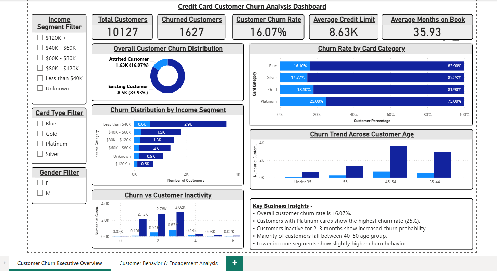

# 💳 Credit Card Customer Churn Analysis

<div align="center">


**An end-to-end analytics project analyzing customer churn patterns in the credit card industry using Excel, Python, SQL, and Power BI.**

⭐ *If this project helped you, please consider giving it a star!*

</div>

---

## 📑 Table of Contents

- [Project Overview](#-project-overview)
- [Business Problem](#-business-problem)
- [Dataset Information](#-dataset-information)
- [Project Workflow](#-project-workflow)
- [Tools & Technologies](#️-tools--technologies)
- [Exploratory Data Analysis](#-exploratory-data-analysis-python)
- [SQL Analysis](#️-sql-analysis)
- [Power BI Dashboard](#-power-bi-dashboard)
- [Key Insights](#-key-insights)
- [Business Recommendations](#-business-recommendations)
- [Project Structure](#-project-structure)
- [Dashboard Preview](#️-dashboard-preview)
- [Skills Demonstrated](#-skills-demonstrated)
- [Conclusion](#-conclusion)
- [Author](#-author)

---

## 📌 Project Overview

Customer churn is one of the most costly challenges facing financial institutions — retaining an existing customer is **5–7× more cost-effective** than acquiring a new one.

This project delivers a **complete, end-to-end data analytics solution** on a real-world credit card dataset of **10,127 customers**, combining multiple tools across every stage of the analytics pipeline:

| Stage | Tool | Output |
|-------|------|--------|
| Data Exploration | Microsoft Excel | Pivot tables, trend summaries |
| Statistical Analysis | Python (Pandas, Seaborn) | EDA notebook with visualizations |
| Business Querying | SQL (MySQL) | Structured churn insights |
| Executive Reporting | Power BI | 2-page interactive dashboard |

The final deliverable is an **interactive Power BI dashboard** that allows business stakeholders to explore churn drivers and make data-backed retention decisions.

---

## 🎯 Business Problem

Banks face continuous pressure from **customer attrition**, which directly erodes:

- 📉 **Revenue** — lost transaction fees and interest income
- 💼 **Customer Lifetime Value** — reduced long-term profitability
- 🏦 **Market Competitiveness** — weakened brand loyalty

### Key Business Questions Addressed

| # | Business Question |
|---|------------------|
| 1 | What is the overall customer churn rate? |
| 2 | Which demographic segments have the highest churn risk? |
| 3 | Does card category (Blue, Silver, Gold, Platinum) influence churn? |
| 4 | Do inactive customers churn at higher rates? |
| 5 | How does transaction volume and frequency correlate with churn? |
| 6 | Do long-tenure customers show stronger loyalty? |

---

## 📊 Dataset Information

**Source:** BankChurners Dataset &nbsp;|&nbsp; **Records:** 10,127 customers &nbsp;|&nbsp; **Target Variable:** `Attrition_Flag`

| Category | Features |
|----------|----------|
| 👤 Customer Demographics | Age, Gender, Income Category, Education Level, Marital Status |
| 🏦 Account Information | Card Category, Credit Limit, Months on Book |
| 🤝 Customer Engagement | Number of Products (Relationship Count) |
| 💸 Activity Metrics | Total Transaction Amount, Total Transaction Count |
| 📊 Credit Behavior | Credit Utilization Ratio, Revolving Balance |
| 🎯 Churn Indicator | Attrition Flag (`Existing Customer` / `Attrited Customer`) |

The dataset's combination of **behavioral, demographic, and financial features** makes it well-suited for multi-dimensional churn analysis.

---

## 🔄 Project Workflow

```
Raw Dataset (BankChurners.csv)
        │
        ▼
📊 Excel — Initial exploration, pivot tables, conditional formatting
        │
        ▼
🐍 Python EDA — Statistical analysis, distribution plots, correlation heatmaps
        │
        ▼
🗄️ SQL Analysis — Business queries, aggregations, segment comparisons
        │
        ▼
📈 Power BI — Interactive 2-page executive dashboard
```

Each stage progressively deepens the analytical understanding of churn behavior.

---

## 🛠️ Tools & Technologies

| Tool | Libraries / Version | Purpose |
|------|---------------------|---------|
| 🐍 Python | Pandas, NumPy, Matplotlib, Seaborn | EDA & statistical analysis |
| 🗄️ SQL | MySQL | Business data queries & aggregations |
| 📊 Microsoft Excel | Pivot Tables, Charts | Initial data exploration |
| 📈 Power BI | DAX, Power Query | Interactive dashboard & KPI reporting |

---

## 🔎 Exploratory Data Analysis (Python)

Python EDA was used to statistically profile the dataset and identify early churn signals before building dashboard views.

### Analyses Performed

- **Churn Distribution** — Class balance check (Existing vs. Attrited customers)
- **Demographic Profiling** — Age, gender, income, and education breakdowns by churn status
- **Credit Utilization Analysis** — Distribution of utilization ratios across churn groups
- **Transaction Behavior** — Comparison of total transaction amount & count between churned and retained customers
- **Correlation Heatmap** — Feature relationships to identify multicollinearity and churn predictors
- **Relationship Count Analysis** — Number of bank products held vs. churn rate

### Libraries Used

```python
import pandas as pd              # Data manipulation
import numpy as np               # Numerical computation
import matplotlib.pyplot as plt  # Static visualizations
import seaborn as sns            # Statistical plotting
```

> 📓 Full analysis available in [`Python-EDA/churn_analysis.ipynb`](Python-EDA/churn_analysis.ipynb)

---

## 🗄️ SQL Analysis

SQL was used to run **structured business queries** that translate raw data into measurable churn metrics for stakeholder reporting.

### Queries Performed

| Query | Insight |
|-------|---------|
| Churn count by Attrition Flag | Overall churn volume |
| Churn rate by card category | Product-level attrition |
| Average credit limit by churn status | Financial behavior differences |
| Transaction metrics by churn status | Engagement-level comparison |
| Customer tenure distribution | Loyalty pattern identification |
| Inactivity months vs. churn | Activity-based churn signal |

### Example Query — Churn Rate by Card Category

```sql
SELECT
    Card_Category,
    COUNT(*) AS total_customers,
    SUM(CASE WHEN Attrition_Flag = 'Attrited Customer' THEN 1 ELSE 0 END) AS churned_customers,
    ROUND(
        SUM(CASE WHEN Attrition_Flag = 'Attrited Customer' THEN 1 ELSE 0 END) * 100.0 / COUNT(*), 2
    ) AS churn_rate_pct
FROM bank_churn
GROUP BY Card_Category
ORDER BY churn_rate_pct DESC;
```

> 📄 All queries documented in [`SQL/SQL_Query_Documentation.md`](SQL/SQL_Query_Documentation.md)

---

## 📈 Power BI Dashboard

An **interactive 2-page Power BI dashboard** was built to communicate churn insights to both executive and analytical audiences.

---

### 📊 Page 1 — Executive Overview

> *Designed for senior management — answers the "where and how much" of churn.*

**KPI Cards:**

| Metric | Description |
|--------|-------------|
| Total Customers | Full customer base count |
| Churned Customers | Number of attrited customers |
| Churn Rate % | Overall attrition percentage |
| Avg. Credit Limit | Mean credit limit across all customers |
| Avg. Customer Tenure | Average months on book |

**Visuals Included:**
- Donut chart — Overall churn distribution
- Stacked bar — Churn by card category
- Bar chart — Churn rate by income segment
- Histogram — Churn across age groups
- Bar chart — Inactive months vs. churn rate

---

### 📊 Page 2 — Customer Behavior Analysis

> *Designed for analysts and retention teams — answers the "why" of churn.*

**Behavioral KPIs:**

| Metric | Description |
|--------|-------------|
| Avg. Transaction Amount | Mean spend per customer |
| Avg. Transaction Count | Mean transaction frequency |
| Avg. Credit Utilization Ratio | Mean revolving balance usage |

**Visuals Included:**
- Box plots — Credit utilization distribution by churn status
- Scatter plot — Transaction count vs. amount colored by churn
- Bar chart — Relationship count vs. churn rate
- Line chart — Customer tenure vs. churn rate trend

---

## 🔑 Key Insights

| # | Insight | Business Impact |
|---|---------|----------------|
| 1 | **~16.07% overall churn rate** (1,627 of 10,127 customers) | Significant revenue risk |
| 2 | Churned customers completed **~45% fewer transactions** on average | Strong behavioral churn signal |
| 3 | **Over 90%** of customers hold Blue card — highest absolute churn volume | Largest segment requiring attention |
| 4 | Customers with **≤2 banking products** churn at nearly 2× the rate | Cross-sell opportunity identified |
| 5 | **83% of customers** utilize less than 30% of their credit limit | Low engagement correlates with churn |
| 6 | Customers inactive for **3+ months** show significantly higher churn probability | Inactivity as an early warning signal |
| 7 | Long-tenure customers (36–48 months on book) demonstrate stronger loyalty | Loyalty program opportunity |

---

## 💡 Business Recommendations

### 1. 🔔 Proactive Inactivity Monitoring
Deploy automated alerts for customers showing 2+ months of inactivity. Intervene with personalized re-engagement offers before churn occurs.

### 2. 🤝 Accelerate Cross-Selling Initiatives
Customers with 3+ products churn at significantly lower rates. Introduce bundled product incentives (savings accounts, personal loans) during onboarding.

### 3. 🎁 Targeted Transaction Incentives
Design cashback or rewards campaigns for customers with declining transaction counts — a key leading indicator of churn.

### 4. 🏆 Loyalty & Tenure Recognition Programs
Formalize milestone rewards at 12, 24, and 36-month tenure marks to reinforce long-term retention behavior.

### 5. 📊 Segment-Specific Retention Campaigns
Tailor strategies by income segment and card category — lower-income and Blue card holders represent the largest churn volume.

---

## 📁 Project Structure

```
Credit-Card-Churn-Analysis/
│
├── 📂 Dataset/
│   └── BankChurners.csv                            # Raw dataset (10,127 records)
│
├── 📂 Excel/
│   └── Excel_Analysis.xlsx                         # Pivot tables & exploratory charts
│
├── 📂 Python-EDA/
│   └── churn_analysis.ipynb                        # Full EDA notebook
│
├── 📂 SQL/
│   ├── 01_database_setup.sql                       # Database creation script
│   ├── 02_table_creation.sql                       # Schema definition
│   ├── 03_data_verification.sql                    # Data quality checks
│   ├── 04_business_queries.sql                     # Analytical business queries
│   └── SQL_Query_Documentation.md                  # Query explanations & results
│
├── 📂 PowerBI/
│   └── Credit-Card-Churn-Analysis-Dashboard.pbix   # Interactive dashboard file
│
├── 📂 Screenshots/
│   ├── Customer-Churn-Dashboard-Executive-Overview.png
│   └── Customer-Churn-Dashboard-Behavior-Analysis.png
│
└── README.md
```

---

## 🖥️ Dashboard Preview

### Page 1 — Executive Overview


### Page 2 — Customer Behavior Analysis


---

## 🚀 Skills Demonstrated

| Domain | Skills Applied |
|--------|---------------|
| **Data Preparation** | Data cleaning, type casting, missing value handling, feature understanding |
| **Exploratory Analysis** | Statistical profiling, distribution analysis, correlation analysis |
| **SQL** | Aggregations, CASE statements, GROUP BY, subqueries, KPI derivation |
| **Data Visualization** | Chart selection, color encoding, layout design, data storytelling |
| **Business Intelligence** | KPI definition, DAX measures, Power BI design, executive reporting |
| **Analytical Thinking** | Translating business questions into analytical frameworks |
| **Documentation** | Structured, stakeholder-ready reporting in Markdown |

---

## 📌 Conclusion

This project demonstrates how a **multi-tool analytics approach** can uncover deep customer churn patterns in the financial services industry.

By systematically progressing through **Raw Data → Excel Exploration → Python EDA → SQL Business Queries → Power BI Dashboard**, the analysis delivers both **technical depth** and **business relevance**.

The insights generated — particularly around transaction inactivity, cross-product holding, and tenure loyalty — provide **actionable, data-driven recommendations** that a banking retention team could directly implement.

---

## 👨‍💻 Author

<div align="center">

### **Tanuja Gunjal**

Passionate about transforming raw data into business insights through analytics, visualization, and storytelling.

**Tech Stack:**


</div>

---

<div align="center">

*📊 Built with curiosity, structured thinking, and a commitment to data-driven decision-making.*

</div>
